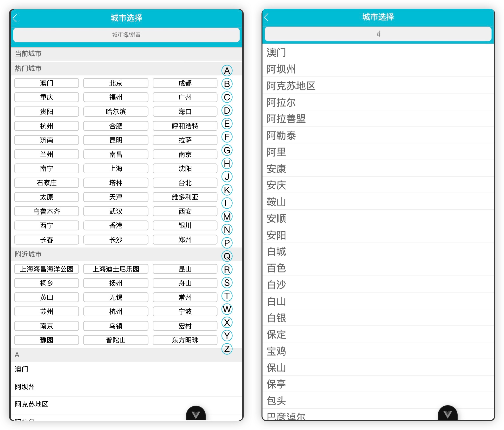

# 1 Where to go

1.1 video thumbnail overview



1.2 [Click here to watch video](thumbnail/video-thumbnail.mp4)

1.3 Video demonstration

<video style="transform: scale(0.35); transform-origin: top left;" controls>
  <source src="thumbnail/video-thumbnail.mp4" type="video/mp4">
  您的浏览器不支持 HTML5 视频标签。
</video>

# 2 Project setup

This template should help get you started developing with Vue 3 in Vite.

## Requirements

node version greater than or equal to 18.0.0

## Recommended IDE Setup

[VSCode](https://code.visualstudio.com/) + [Volar](https://marketplace.visualstudio.com/items?itemName=Vue.volar) (and
disable Vetur).

## Customize configuration

See [Vite Configuration Reference](https://vitejs.dev/config/).

## Project Setup

```sh
npm install
```

### Compile and Hot-Reload for Development

```sh
npm run dev

```

### Compile and Minify for Production

```sh
npm run build
```

### Lint with [ESLint](https://eslint.org/)

```sh
npm run lint
```
